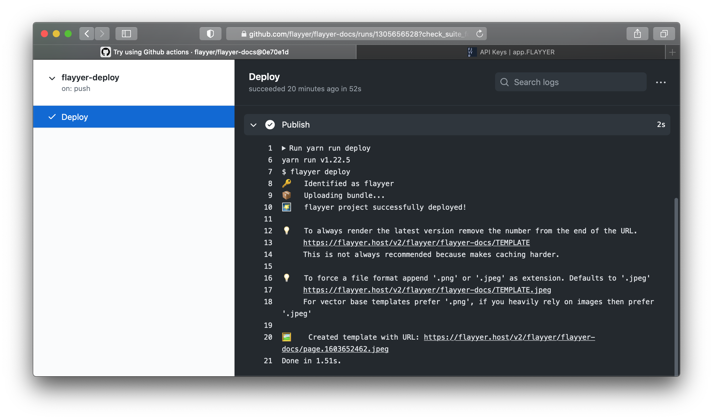
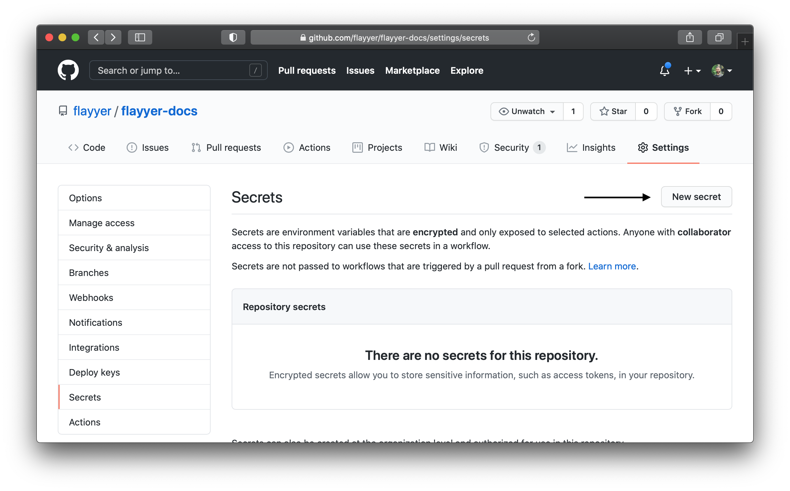

# Flayyer Actions and Workflows for GitHub



## Create workflow file

Create the following file in your repository:

```sh
mkdir -p .github/workflows
touch .github/workflows/deploy.yml
```

Copy the contents of from [workflow-templates/flayyer-yarn.yml](./workflow-templates/flayyer-yarn.yml) to your `.github/workflows/deploy.yml`.

### Via `curl`:

Write these two lines on your terminal:

```sh
mkdir -p .github/workflows
curl -L https://raw.githubusercontent.com/flayyer/flayyer-actions/main/workflow-templates/flayyer-yarn.yml --output .github/workflows/deploy.yml
```

## Add `FLAYYER_KEY` to your Github's secrets

Get your `FLAYYER_KEY` from [https://app.flayyer.com/en/settings/keys](https://app.flayyer.com/en/settings/keys) then add it to your **Settings -> Secrets** inside the settings of your repository.



## Help needed

- Convert to an actual Github Action.
- Create NPM alternative and make it easy to switch between Yarn and NPM.
